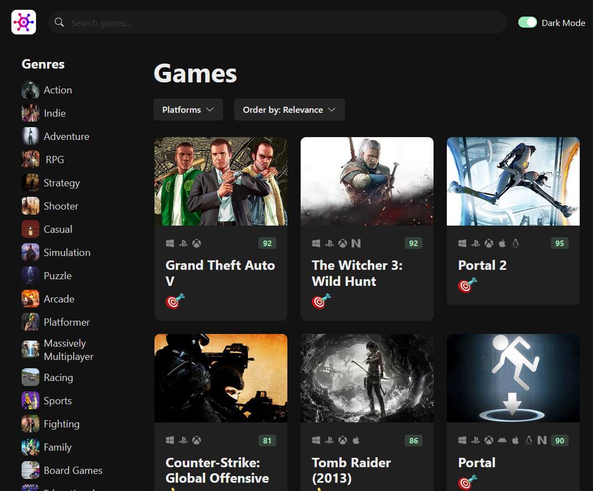
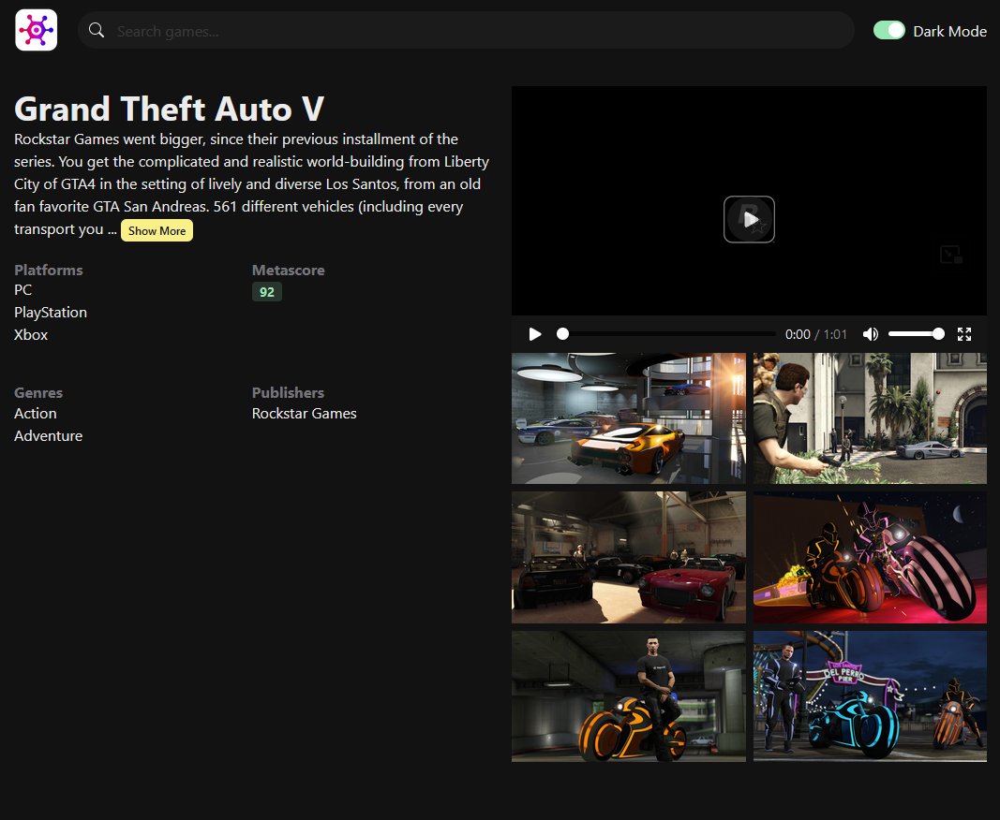

# Video Game Discovery App

- Webapp to search for your favorite video games.
- You can search for keywords, or prefered genres, platforms...
- Live demo [here](https://video-games-discovery-app.vercel.app/)

## General Information

- React app, using rawg API
- As a porfolio &amp; hobby project

## Technologies Used

- Nodejs
- React
- TypeScript
- ChakraUI

## Features

- Reposive layout
- Dark & Light mode
- Skeleton display when loading page
- Infinitie scroll

## How To Run

- Get a api key from [RAWG page](https://rawg.io/apidocs):
- Then create `.env` file in main folder with your key

> VITE_API_KEY=your_key_here

- Finally run install commands:

``` bash
npm install
npm run dev
```

## Screenshots




